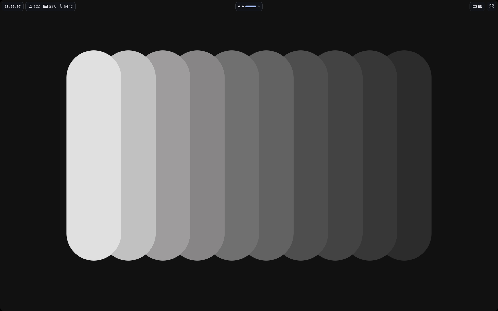
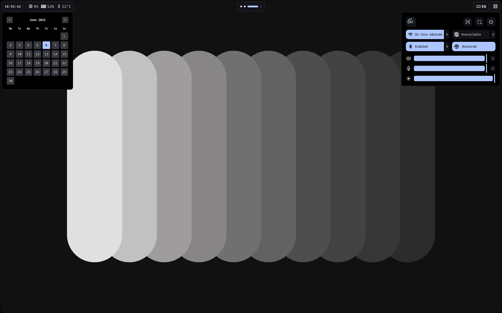
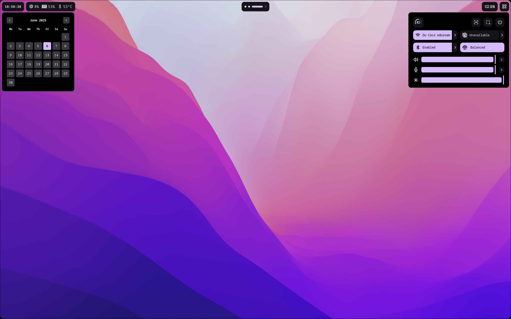
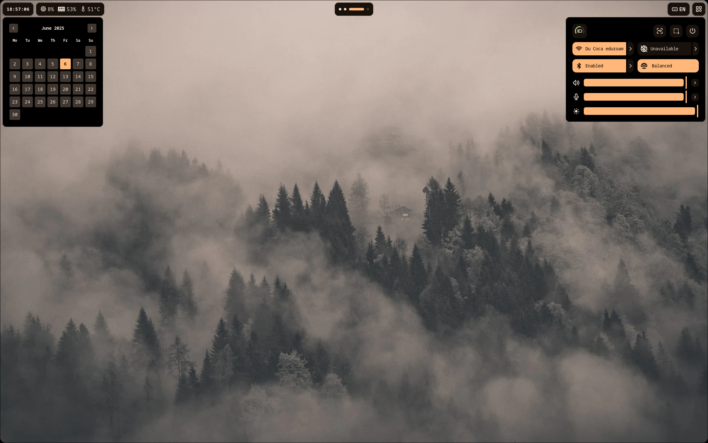

# My-Shell

This project is my implementation of a all-in-one wayland shell. It is pretty and works (most of the time).


# Preview







# Installation

To install my-shell, first clone the repository:

```bash
git clone https://github.com/Angus-Paillaugue/My-Shell.git ~/.config/my-shell \
cd ~/.config/my-shell
```

Then, install the dependencies (may need to create a virtual environment first `python3 -m venv /venv`):

```bash
pip install -r requirements.txt
```

The, run the init script to set up the configuration files:

```bash
python init.py
```
