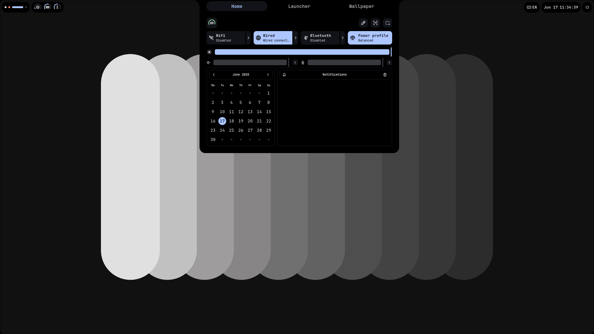
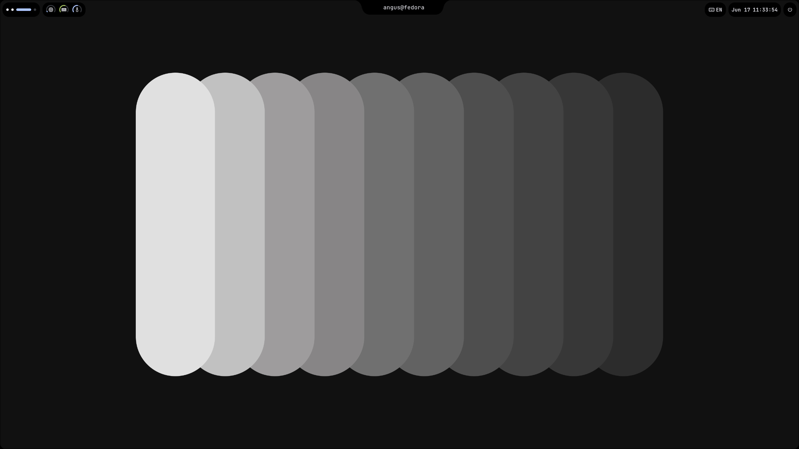
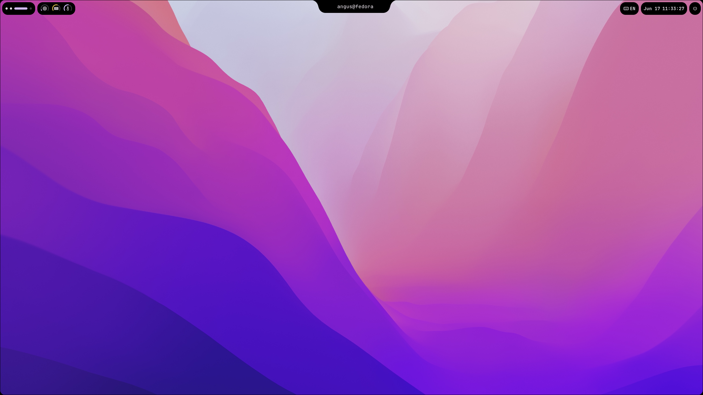
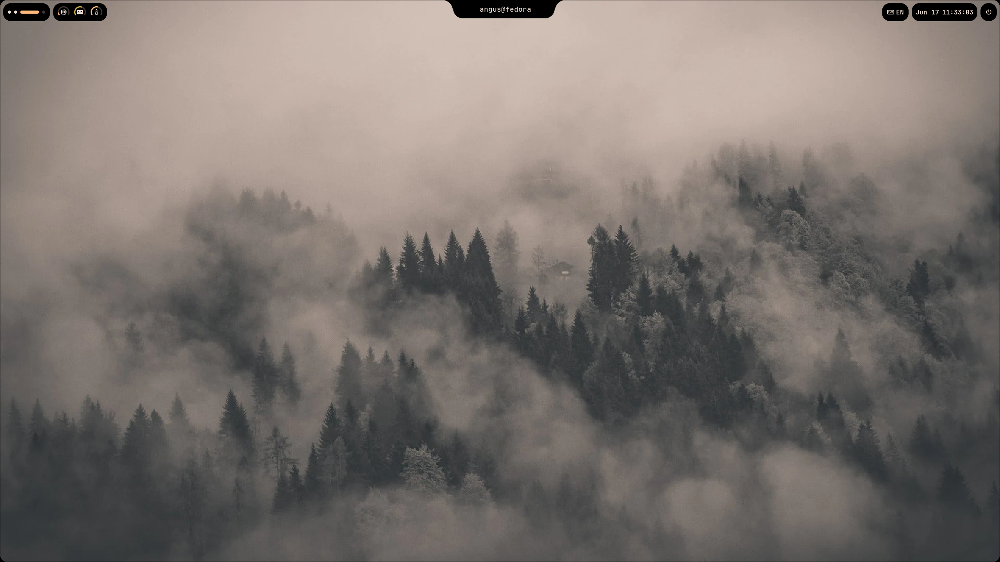
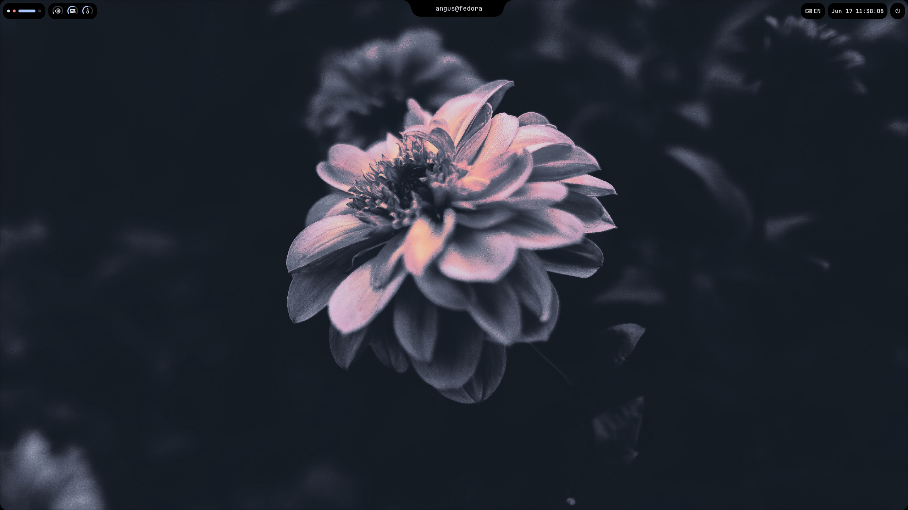

# My-Shell

This project is my implementation of a all-in-one wayland shell. It is pretty and works (most of the time).


# Preview









# Installation

To install my-shell, first clone the repository:

```bash
git clone https://github.com/Angus-Paillaugue/My-Shell.git ~/.config/my-shell && cd ~/.config/my-shell
```

Then, create a virtual environment and install the dependencies:

```bash
make venv && make install
```

The, run the init script to set up the configuration files:

```bash
make init
```

If all goes well, the shell should start on it's own. If not, you can start it manually with:

```bash
make run
```
